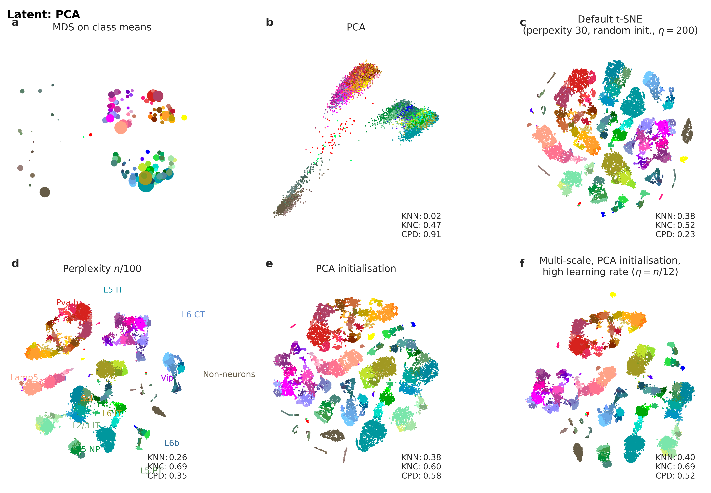
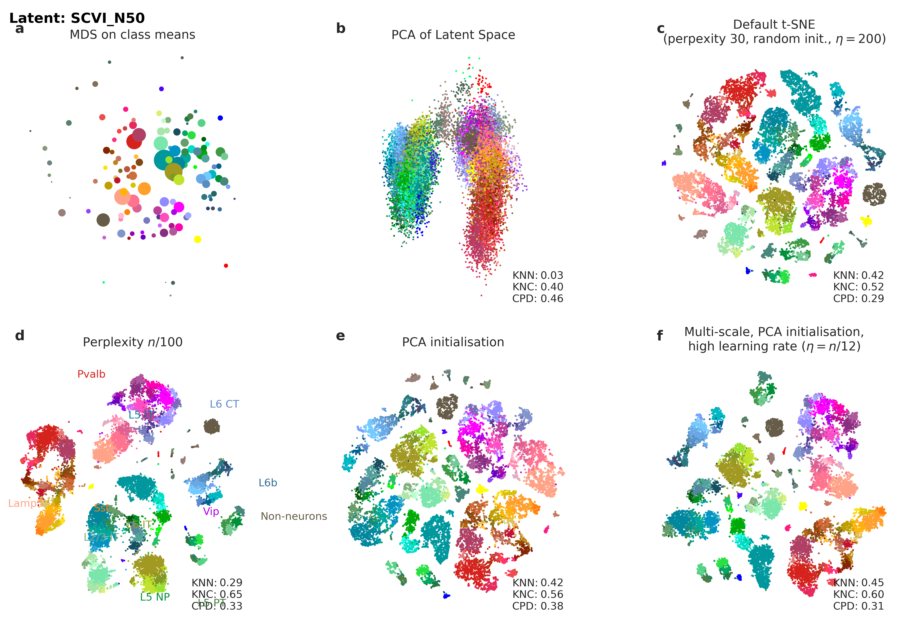
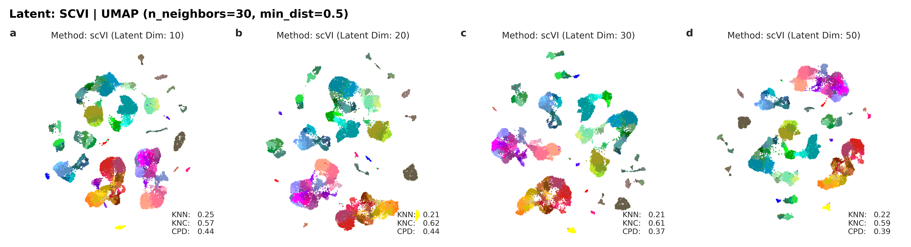

# Comparative Evaluation of PCA and scVI Latent Spaces for scRNA-seq Embedding

This repository documents an exploratory, reproducible plan to evaluate how latent geometry affects downstream embeddings.

> Note: This README is a working draft under active revision. The document describes a small-scale, exploratory comparative study rather than a large-scale benchmark; wording and interpretation may be updated as additional results are generated.

> Temporary Note: I will be unavailable for development from 2026-05-27 to 2026-06-01; expect delayed responses during this period.

## Executive Summary
This repository compares two latent representations (PCA and scVI) and evaluates multiple downstream 2D embedding workflows (array-based Kobak t‑SNE/UMAP and Scanpy's graph‑based UMAP).
- PCA with Kobak-style t-SNE/UMAP as the linear reference.
- scVI latent representations embedded with the same array-based Kobak-style embedding setup.
- scVI latent representations embedded using Scanpy's graph-based UMAP workflow.

In the current experiments the PCA-initialized Kobak settings perform well on PCA latents, while the same array-based settings transfer less consistently to scVI latents. I do not see a defensible basis here for claiming that the Scanpy graph-based workflow is better on this dataset; the safer reading is that the graph-based workflow is a conventional downstream choice, but in these runs it does not show a clear advantage, and any apparent differences should be treated as exploratory observations pending the planned robustness tests.

## Key Comparison Figures
The following PDFs provide the primary visual comparison used in this report:
- [PCA baseline](results/figures/pca/n50/tasic-variants.pdf)
- [scVI Kobak-style result](results/figures/scvi/n50/tasic-variants.pdf)
- [scVI Scanpy workflow result](results/scvi_scanpy_workflow/figures/umap_n30_md05_scanpy_4panels.pdf)

In the current document structure, these figures are intentionally placed before the long-form methodological narrative to make the core comparison visible at first pass.

## Figure 1 — Visual comparison (click thumbnails for PDFs)
[](results/figures/pca/n50/tasic-variants.pdf)  
*PCA baseline — Kobak-style variants (50 PCs).*  

[](results/figures/scvi/n50/tasic-variants.pdf)  
*scVI latents + Kobak-style embedding (array-based t-SNE/UMAP).*  

[](results/scvi_scanpy_workflow/figures/umap_n30_md05_scanpy_4panels.pdf)  
*scVI latents visualized with Scanpy graph-based UMAP (n=30, min_dist=0.5).*  

## 1. Introduction & Motivation
High-dimensional single-cell RNA-sequencing (scRNA-seq) data is usually explored with nonlinear dimensionality reduction methods such as t-SNE and UMAP. In *The art of using t-SNE for single-cell transcriptomics* [Kobak & Berens, 2019](https://www.nature.com/articles/s41467-019-13055-y), PCA initialization and careful parameter choice are enough to recover both local cluster structure and a coarse global layout.

I started this project after reading Kobak's lectures and paper. I wanted a small-scale, reproducible setup that can be run locally yet is large enough to expose common failure modes of downstream embeddings. The Tasic dataset was a practical choice for that reason: it is large enough to be informative, but still manageable without a dedicated GPU during prototyping.

The primary question explored here is whether replacing a linear PCA latent space with a count-aware generative latent space such as scVI affects downstream visualizations: does the downstream visualization improve, or does the latent geometry interact differently with embedding assumptions optimized for PCA-based workflows?

I deliberately leave generic autoencoders out of the main comparison. For raw-count scRNA-seq data, a Gaussian reconstruction loss is not an ideal noise model, which would confound a straightforward comparison with PCA. scVI provides a commonly used count-aware latent modeling framework for scRNA-seq data.

This repository builds on the Kobak lab reference implementation [rna-seq-tsne](https://github.com/berenslab/rna-seq-tsne) and uses [FIt-SNE](https://github.com/KlugerLab/FIt-SNE) for the t-SNE runs.


## 2. Quick Start
1. Create the environment from the provided spec. The provided `environment.yml` includes `name: tasic_benchmark`, so the following command will create an environment with that name:

	```bash
	conda env create -f environment.yml
	```

If you prefer a different environment name or a custom installation path, you can override this at creation time:

	```bash
	# create with a custom name
	conda env create -f environment.yml --name myenv

	# or create at a specific path
	conda env create -f environment.yml --prefix /path/to/env
	```

2. Activate the environment.

	```bash
	conda activate tasic_benchmark
	```

If you created the environment with `--name myenv` use `conda activate myenv`, or if you used `--prefix` activate using the full path (`conda activate /path/to/env`).

3. Check that the bundled t-SNE binary exists.

	```bash
	ls FIt-SNE/bin/fast_tsne
	```

	If this file is missing, follow the upstream FIt-SNE build instructions:
	https://github.com/KlugerLab/FIt-SNE

4. Run the pipeline with Nextflow.

	```bash
	nextflow run main.nf -resume
	```

The `environment.yml` file captures the main Python stack used for development (notably `scanpy`, `anndata`, `scvi-tools`-compatible dependencies, `umap-learn`, and `scikit-learn`) together with `nextflow` for workflow execution.

### Environment summary
Key packages captured in `environment.yml` (concise):

- **Python:** 3.10.20
- **scvi-tools:** 1.3.3 (pip)
- **scanpy:** 1.11.5
- **anndata:** 0.11.4
- **umap-learn:** 0.5.12
- **scikit-learn:** 1.7.2
- **nextflow:** 26.04.1
- **FIt-SNE:** bundled binary in `FIt-SNE/bin/fast_tsne` (check before running)

For full reproducibility, consult `environment.yml` for the complete dependency list and pinned versions.

## Repository Structure

```text
scRNA-repr-benchmark/
├── main.nf                     # Nextflow workflow entry point
├── nextflow.config             # workflow configuration
├── environment.yml             # conda environment spec (tasic_benchmark)
├── README.md                   # project overview, interpretation, and plan
│
├── data/                       # input data and preprocessed matrices
│   └── *.h5ad                  # Tasic raw/preprocessed AnnData files
│
├── scripts/                    # analysis code
│   ├── preprocessing.py        # gene selection, normalization, QC
│   ├── latent_model.py         # PCA / scVI latent construction
│   ├── embedding.py            # t-SNE / UMAP embedding runs
│   ├── evaluation.py           # metrics (KNN, KNC, CPD, etc.)
│   ├── visualization.py        # static plots and summary figures
│   └── *.py                    # supporting utilities and plotting helpers
│
├── REFERENCE-rna-seq-tsne/     # Kobak reference notebooks and helpers
│   ├── demo.ipynb              # reference workflow notebook
│   ├── umap-comparison.ipynb   # UMAP parameter comparison
│   └── rnaseqTools.py          # reference gene-selection helper
│
├── FIt-SNE/                    # bundled FIt-SNE source and binary
│   ├── bin/fast_tsne           # compiled FIt-SNE binary
│   ├── src/                    # upstream source code
│   └── examples/               # example notebooks and runs
│
├── results/                    # generated outputs
│   ├── figures/                # exported PNG/PDF figures used in README
│   ├── embeddings/             # latent space / embedding outputs
│   ├── metrics/                # metric tables and summaries
│   ├── batch_explore/          # exploratory run outputs
│   └── scvi_scanpy_workflow/   # Scanpy-based comparison figures
│
└── work/                       # Nextflow work directory (intermediate outputs)
```

## 2. Aims and Objectives
The study is organized around the following objectives:
1. **Baseline reproduction:** To reproduce the cortical separation patterns reported in the reference paper using PCA with 50 dimensions, PCA initialization, and Kobak-style FIt-SNE settings.
2. **Core benchmark:** To compare PCA with scVI by replacing the linear PCA latent space with scVI latents and evaluating the resulting t-SNE/UMAP embeddings.
3. **Scope of applicability:** To maintain a preprocessing pipeline that can be extended to additional raw-count datasets, while validating the present implementation on the Smart-seq2-based Tasic benchmark.
4. **Dual-track comparison:** To evaluate both a fixed 50-dimensional setting and model-specific latent dimensions.
5. **Quantitative evaluation:** To assess embeddings using KNN retention, KNC purity, and CPD.
6. **Reproducibility:** To implement the workflow in Nextflow so it can be reproduced locally and, if needed, transferred to HPC environments.

## 3. Biological Context (Tasic et al. 2018)
To evaluate structure preservation, I use the ~24,000 mouse cortical cells dataset sequenced with Smart-seq2 in [Tasic et al. 2018](https://www.cell.com/cell/fulltext/S0092-8674(18)30751-4), sampled from the visual (VISp) and anterior lateral motor (ALM) cortices.

The dataset gives me a useful biological reference:
- **GABAergic (Inhibitory) neurons** are highly conserved transcriptomically across both VISp and ALM regions (expected to intermingle in embedding space).
- **Glutamatergic (Excitatory) neurons** possess distinct, region-specific signatures (expected to segregate cleanly into VISp and ALM branches).
The benchmark asks which latent representation most faithfully captures this known biological manifold.

## 4. Methodology
### 4.1 Data Preprocessing
Using the Kobak & Berens reference workflow:
- Outlier filtering based on provided metadata (masking 'Good cells').
- Library size normalization (CPM).
- Log-transformation: $\log_2(CPM + 1)$.
- Feature selection: Top 3,000 Highly Variable Genes (HVGs).
*(Note: scVI is trained on the raw HVG count matrix with a ZINB likelihood; it does not use the CPM/log-transformed input used for PCA.)*

Implementation notes:
- `scripts/preprocessing.py` ports the Kobak gene-selection heuristic from `rnaseqTools.geneSelection(...)` with `threshold=32`, `n=3000`, `decay=1.5`, `yoffset=0.02`, and the same binary search over `xoffset`.
- The `Chosen offset: 6.56` style line is not a fixed parameter; it is the final `xoffset` found by that binary search when the requested number of genes is reached.
- The CPM plus log transform is implemented as `normalize_total(target_sum=1e6)` followed by `log1p(base=2)`, which matches the notebook's `np.log2(CPM + 1)`.
- `scripts/latent_model.py` uses `sklearn.decomposition.PCA(n_components=50, svd_solver='full')` and the same PC sign-flip convention as the Kobak notebook.

### 4.2 Latent Representations
- **PCA:** Linear baseline (reference point).
- **scVI:** [scvi-tools](https://scvi-tools.org/) latent representation learned from the raw HVG count matrix with a count-aware ZINB likelihood.


### 4.3 Dimensionality Reduction
- **t-SNE implementation:** `scripts/embedding.py` uses the Kobak FIt-SNE wrapper interface and the same recommended settings: PCA-style initialization, learning rate $N/12$, and multi-scale perplexity `[30, N/100]`.
- **UMAP implementation:** The reference notebook `REFERENCE-rna-seq-tsne/umap-comparison.ipynb` compares two Tasic UMAP parameterizations. The second configuration (`random_state=1`, `n_neighbors=30`, `min_dist=0.5`) is used as the default in this work because it reproduces the reference material and is used for downstream comparisons.

Kobak-derived pieces intentionally preserved in this pipeline:
- Gene selection heuristic and its binary-search thresholding behavior.
- CPM normalization and base-2 log transform.
- PCA with `svd_solver='full'` and sign correction.
- FIt-SNE recommendation of PCA initialization, $N/12$ learning rate, and multi-scale perplexity.
- UMAP benchmark settings from the supplementary notebook, with the second setting chosen for the default pipeline.

### 4.4 Quantitative Evaluation
- **KNN Preservation:** local neighborhood retention between the original space and the reduced embedding.
- **KNC Purity:** preservation of class-level neighborhood coherence, which captures whether biologically similar cells remain adjacent after projection.
- **CPD:** Spearman correlation between pairwise distances in the original gene space and the reduced space, used here as a proxy for global structure preservation.

## 5. Results & Discussion

### 5.1 What I Expected
The initial expectation was that scVI would produce a cleaner latent space than PCA because it models scRNA-seq counts more directly. That remains plausible at the latent-space level, but it does not automatically imply improved performance under a PCA-optimized embedding setup.

### 5.2 What the Current Numbers Indicate
The reported metric summaries indicate that the PCA-initialized Kobak settings perform well on PCA latents, while the same array-based settings are less consistent when applied to scVI latents.

The comparison between the array-based Kobak workflow and the Scanpy graph-based workflow is influenced by the geometry of the learned scVI latent space: the former operates directly on Euclidean coordinates, whereas the latter first constructs a neighborhood graph before applying UMAP. In this dataset I do not see a clear global-structure advantage for the graph-based workflow. CPD can be useful as one summary measure, but it also has limitations, so the more cautious conclusion is that the figures do not show a large or decisive difference in global structure preservation.

| Track | Embedding | KNN | KNC | CPD | Short note |
| --- | --- | ---: | ---: | ---: | --- |
| PCA baseline | t-SNE, PCA init | 0.383 | 0.605 | 0.578 | Strong global preservation (current setup) |
| PCA baseline | UMAP, n30/md0.5 | 0.208 | 0.634 | 0.559 | Good global structure, weaker KNN |
| scVI Kobak-style | t-SNE, PCA init | 0.424 | 0.565 | 0.377 | Better local retention, weaker global match |
| scVI Kobak-style | UMAP, n30/md0.5 | 0.213 | 0.623 | 0.350 | More balanced than t-SNE, still below PCA CPD |

These values are from the completed array-based benchmark runs.

## Interpretation & Hypotheses (working draft)
This section is still being revised. The present observations (PCA latents yielding more consistent results under the Kobak‑style pipeline than scVI latents) are reported as empirical findings rather than definitive conclusions. Multiple, non‑exclusive mechanisms could contribute to the observed differences; below we describe the most plausible ones and the simple diagnostics we will use to probe them.

One plausible mechanism is that scVI latents are less isotropic than PCA space. PCA produces a variance‑ordered coordinate system by construction, while scVI does not enforce axiswise variance structure. If scVI exhibits a steeper eigenvalue spectrum or a lower isotropy index, distance‑based embedding methods that assume more uniform scales across axes could be affected. We will examine eigenvalue spectra (PCA applied to latents) and report a compact isotropy statistic (for example, geometric mean divided by arithmetic mean of eigenvalues) to evaluate this possibility.

Local manifold curvature is another candidate explanation. If scVI places neighborhood points on more curved, nonlinear manifolds, a PCA‑based initialization for t‑SNE may bias the optimizer toward PCA‑like global layouts and reduce the algorithm's ability to follow scVI's intrinsic geometry. To probe local nonlinearity we will perform PCA within k‑neighborhoods and compare distributions of local explained variance between PCA and scVI latents.

Initialization effects themselves may also matter: PCA initialization for t‑SNE can implicitly favour PCA‑aligned structure, whereas random initialization allows the algorithm greater freedom to follow the latent geometry. We will compare t‑SNE embeddings run with PCA and random initializations on the same latent representations and report how KNN, CPD and related diagnostics change.

> Heterogeneous local densities in the latent space could produce additional distortions. If scVI creates regions of compression and expansion, density‑sensitive methods such as t‑SNE and UMAP may distort those regions differently; we will therefore compare local kNN distance distributions and neighborhood compactness measures to assess density effects and explore simple density‑aware normalizations.

Finally, graph‑based UMAP may appear more favourable on scVI latents because constructing a kNN graph can stabilise neighborhood relations that are less well captured by direct Euclidean comparisons. We will quantify kNN graph agreement across seeds (for example, using Jaccard overlap of kNN sets) and relate graph stability to downstream UMAP behaviour.

For each hypothesis this study will present the targeted diagnostics (figures and concise summary statistics) so readers can judge which mechanisms are most consistent with the data.

## Limitations

- This is still an exploratory comparative study rather than a final benchmark.
- The present results are based mainly on the Tasic 2018 dataset and a limited number of stochastic runs.
- CPD and the other summary metrics are useful, but each has interpretation limits, so conclusions should remain cautious.

## Future Work

- Formalize the robustness protocol in the pipeline: pilot N = 3, full runs N ≥ 10, seed-wise summaries, and bootstrap confidence intervals.
- Add latent-geometry diagnostics, including eigenvalue spectra, isotropy, local density, and neighborhood agreement.
- Run parameter-sensitivity sweeps for t-SNE and UMAP, then report seed-variance plots and heatmaps.
- Decide whether an additional baseline such as a simple autoencoder or PCA-whitened variant is worth adding.
- Expand to additional datasets if the Tasic-only comparison remains stable.
- Export the pending figures listed above once the remaining runs are complete.

## References
- Kobak, D. & Berens, P. *The art of using t-SNE for single-cell transcriptomics.* [Nature Communications (2019)](https://www.nature.com/articles/s41467-019-13055-y)
- Tasic, B. et al. *Shared and distinct transcriptomic cell types across neocortical areas.* [Cell (2018)](https://www.cell.com/cell/fulltext/S0092-8674(18)30751-4)
- Linderman, G. C. et al. *Fast interpolation-based t-SNE for improved visualization of single-cell RNA-seq data.* [Nature Methods (2019)](https://www.nature.com/articles/s41592-018-0308-4)
